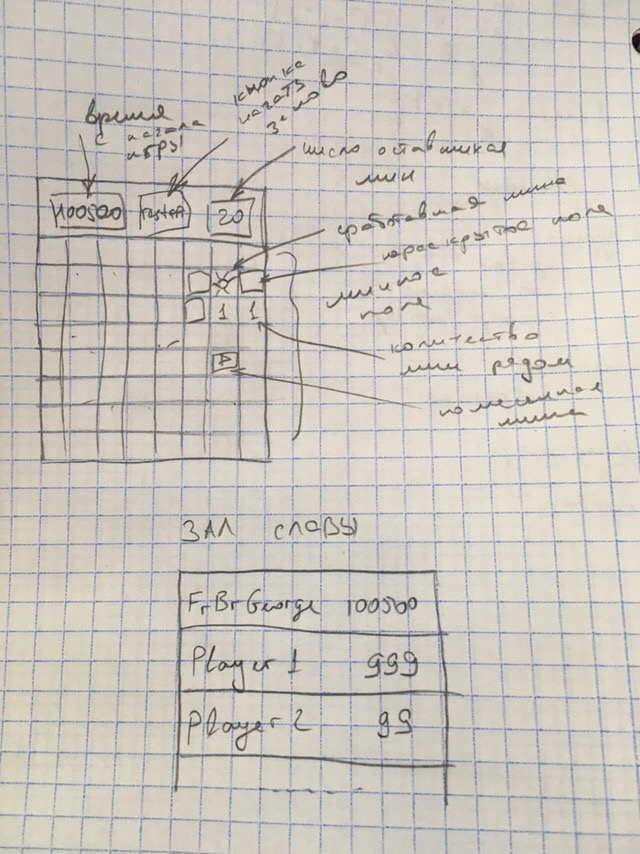

# Игра "Сапер"

В качестве проекта мы планируем делать игру "Сапер".

## Описание игры:
Игроку дается поле размером N*N, на которой находится K бомб, который игрок должен отыскать.

## Схема:

## Разработчики:
* [Имеев М.А.](https://github.com/ImeevMA), группа 316
* [Наволоцкий А.А.](https://github.com/TipTopSX), группа 316
* [Буланбаев А.И.](https://github.com/imArtyfact), группа 316

